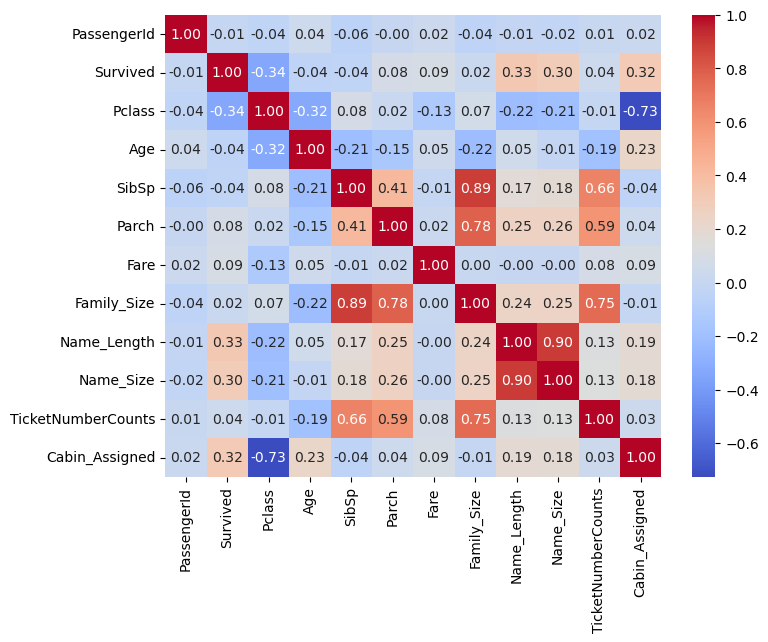

# Analyzing the Titanic Dataset
## Overwiew
Welcome to my Titanic Survival Prediction Project. This project aims to analyze and build machine learning models to predict whether a passenger survived the Titanic disaster based on various features such as age, gender, ticket class, and family relationships.

Using the Titanic dataset, I explored data preprocessing, feature engineering, and multiple classification models, tuning them to achieve the best performance. The final goal was to generate a submission file predicting survival for the test set.

## Notebook
View my notebook with detaield steps here: [Advanced_Prototype.ipynb](Code/Advanced_Prototype.ipynb)

## The Questions
Below are the key questions I wanted to answer through this project:

1. How do different passenger attributes (gender, class, age, etc.) impact survival rates?
2. What are the most important features influencing survival?
3. Which machine learning model provides the highest accuracy for survival prediction?
4. How can feature engineering and hyperparameter tuning improve model performance?

## Tools I Used
For this project, I used a variety of tools to analyze the dataset and build models:

- Python → The backbone of my data analysis and modeling.
- Pandas → Data manipulation and preprocessing.
- Matplotlib & Seaborn → Data visualization.
- Scikit-learn → Machine learning model training and evaluation.
- XGBoost → Gradient boosting for model improvement.

- VS Code → My primary development environment.
- Git & GitHub → Version control and project tracking.

## ML models i used
### I trained multiple models to find the best classifier for survival prediction.
- Random Forest
- Decision Trees
- K-Nearest Neighbours
- Support Vector Classifier
- Logic Regression 
- GaussianNB
- XGBoost
- AdaBoost
- Extra trees
- Gradient Boosting
- Voting Classifier 1
- voting Classifier 2


## Data Understanding & Preparation
This section outlines the dataset used and the steps taken to clean, process, and prepare the data for modeling.

### Dataset Overview
The dataset consists of two main files:

- `train.csv` → Includes passenger information along with survival outcomes (`Survived` = 0 or 1).
- `test.csv` → Includes passenger information but without survival labels.
- `gender_submission.csv` → A sample submission file assuming all females survived.
```
╒════╤═══════════╤════════════════════════════════════╤═════════════╕
│    │ Feature   │ Description                        │ Type        │
╞════╪═══════════╪════════════════════════════════════╪═════════════╡
│  0 │ Survived  │ Target variable (0 = No, 1 = Yes)  │ Binary      │
├────┼───────────┼────────────────────────────────────┼─────────────┤
│  1 │ Pclass    │ Passenger class (1st, 2nd, 3rd)    │ Categorical │
├────┼───────────┼────────────────────────────────────┼─────────────┤
│  2 │ Sex       │ Passenger gender                   │ Categorical │
├────┼───────────┼────────────────────────────────────┼─────────────┤
│  3 │ Age       │ Passenger age                      │ Continuous  │
├────┼───────────┼────────────────────────────────────┼─────────────┤
│  4 │ SibSp     │ Number of siblings/spouses aboard  │ Integer     │
├────┼───────────┼────────────────────────────────────┼─────────────┤
│  5 │ Parch     │ Number of parents/children aboard  │ Integer     │
├────┼───────────┼────────────────────────────────────┼─────────────┤
│  6 │ Ticket    │ Ticket number                      │ Categorical │
├────┼───────────┼────────────────────────────────────┼─────────────┤
│  7 │ Fare      │ Ticket price                       │ Continuous  │
├────┼───────────┼────────────────────────────────────┼─────────────┤
│  8 │ Cabin     │ Cabin number (many missing values) │ Categorical │
├────┼───────────┼────────────────────────────────────┼─────────────┤
│  9 │ Embarked  │ Port of embarkation (C, Q, S)      │ Categorical │
╘════╧═══════════╧════════════════════════════════════╧═════════════╛

```

## Heatmap correlation matrix for the features


## Libary Used
```Python
import pandas as pd
import numpy as np

import seaborn as sns
import matplotlib.pyplot as plt
%matplotlib inline 

 # Encoders and imputers for handling missing and categorical data.
from sklearn.preprocessing import OrdinalEncoder, OneHotEncoder

# Importing SimpleImputer to handle missing data by filling in missing values.
from sklearn.impute import SimpleImputer

# Importing utilities to create column transformers for preprocessing pipelines.
from sklearn.compose import make_column_transformer, ColumnTransformer


# Importing pipeline utilities to streamline data preprocessing and model training.
from sklearn.pipeline import Pipeline, make_pipeline 


# Importing various machine learning classifiers.
from sklearn.linear_model import LogisticRegression
from sklearn.svm import SVC
from sklearn.tree import DecisionTreeClassifier
from sklearn.neighbors import KNeighborsClassifier
from sklearn.naive_bayes import GaussianNB
from xgboost import XGBClassifier 


# Importing ensemble models for improving model performance.
from sklearn.ensemble import RandomForestClassifier, AdaBoostClassifier, GradientBoostingClassifier, ExtraTreesClassifier, VotingClassifier

#  Functions for cross-validation, splitting data, and hyperparameter tuning.
from sklearn.model_selection import cross_val_score, StratifiedKFold, train_test_split, GridSearchCV 

```


### Encoding & Scaling
- Converted categorical variables (`Sex`, `Embarked`, `Pclass`) using One-Hot Encoding.
- Scaled numerical features (`Fare`, `Age`) using StandardScaler.


## Hyperparameter Tuning (GridSearchCV)

Applied GridSearchCV with StratifiedKFold (5 splits)
Tuned models: Random Forest, Decision Tree, KNN, SVC, Logistic Regression, Naive Bayes, XGBoost, AdaBoost, Extra Trees, Gradient Boosting
Parameters tuned:
n_estimators: [150, 200, 300, 500] (for ensemble models)

max_depth: [10, 13, 15, 17, 20]

min_samples_split: [5, 10, 15]

min_samples_leaf: [2, 4, 5, 6]

criterion: [‘gini’, ‘entropy’]


## Feature Engineering Parameters

Family Size Grouping: Alone, Small, Medium, Large
Title Extraction: Extracted titles from names (e.g., Mr, Mrs, Miss)
Cabin Feature: Converted to binary (Cabin_Assigned)
Handling Missing Values

```Python
family_map = {1: 'Alone', 2: 'Small', 3: 'Small', 4: 'Small', 5: 'Medium', 6: 'Medium', 7: 'Large', 8: 'Large', 11: 'Large'}
train_df['Family_Size_Grouped'] = train_df['Family_Size'].map(family_map)
test_df['Family_Size_Grouped'] = train_df['Family_Size'].map(family_map)
```

```Python
train_df['Title'] = train_df['Name'].str.split(pat=',', expand=True)[1].str.split(pat='.', expand=True)[0].apply(lambda x: x.strip())
test_df['Title'] = test_df['Name'].str.split(pat=',', expand=True)[1].str.split(pat='.', expand=True)[0].apply(lambda x: x.strip())
```

Age: Filled using median or regression
Embarked: Filled with most frequent (S)
Cabin: Converted to binary feature
Voting Classifier Configurations

Hard voting classifier with weighted contributions
Models included: Gradient Boosting, AdaBoost, Extra Trees


# Final Model & Submission
### After evaluating all models, the best-performing model was chosen for the final predictions.


The results show the accuracy scores of various machine learning models for two different test scenarios. The only difference between TEST 1 and TEST 2 is that TEST 2 was simplified by reducing feature complexity (e.g., reducing the number of fare and age categories).

In general, simplifying the features resulted in a slight performance drop for most models.
Decision Trees, K-Nearest Neighbors, XGBoost, AdaBoost, and Gradient Boosting saw noticeable declines in accuracy.
GaussianNB and Support Vector Classifier remained stable or improved slightly.

Voting Classifier 2 performed the best in both tests, achieving 0.78229 in TEST 1 and 0.77751 in TEST 2. This suggests that ensemble methods remained robust despite feature simplification.
Extra Trees and Voting Classifier 1 also maintained high accuracy scores, though slightly lower in TEST 2.

# Innsight from the Analystis 
### Most important features influencing survival:
- Gender (`Sex`) → Females had a higher survival rate.
- Passenger class (`Pclass`) → 1st class passengers survived more.
- Family Size (`FamilySize`) → Those with small families had better survival rates.
- Fare (`Fare`) → Higher ticket prices correlated with better survival rates.
- Port of Embarkation (`Embarked`) → Passengers from Cherbourg had higher survival rates.


## Challenges I Faced
- Handling Missing Data: Imputing missing values for `Age`, `Embarked`, and `Cabin`.
- Feature Engineering: Identifying new useful features to improve predictions.
- Overfitting: Controlled using regularization and hyperparameter tuning.
- Pclass and fare had high correlation. Do i drop them, or combine them to create new features?


# Future Improvements
- Experiment with advanced feature selection.
- Use stacking classifiers for improved performance.
- Experiment more with the parameters. Example is hard or soft voting performing the best etc.
- Test the models performance by testing more with the perameters

```Python
vc2 = VotingClassifier([('abc', CV_abc.best_estimator_),
                        ('etc', CV_etc.best_estimator_),
                          ('nb', CV_gnb.best_estimator_)
                         ], voting='hard', weights=[1,2,3] )
```

# Final Thoughts
This project allowed me to explore real-world machine learning workflows, from data preprocessing to model evaluation. The Titanic dataset is a great starting point for classification problems, and the insights gained can be applied to more complex datasets. It was a great introduction to ML and if i had more time then i would try to imporve the models perfromance. 


